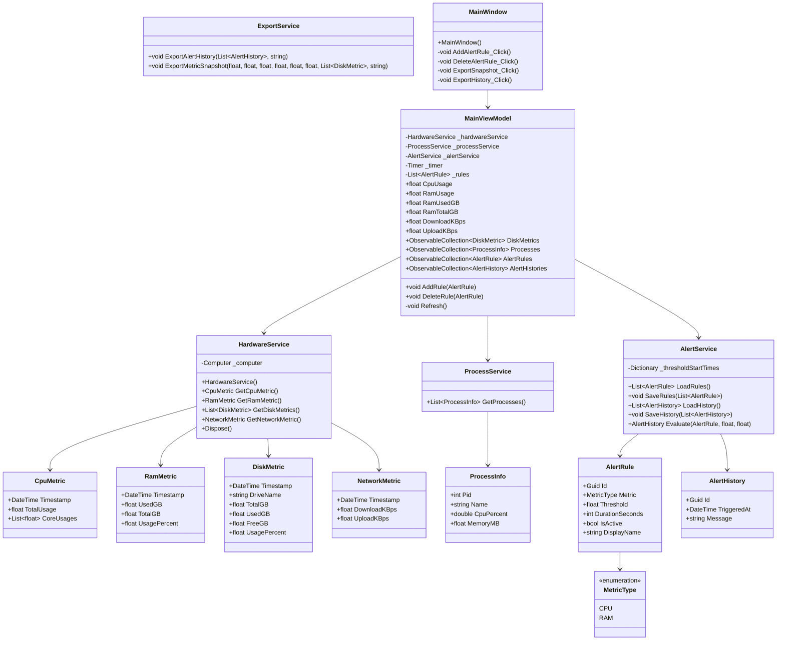

# Class Diagram

```mermaid
classDiagram
    class CpuMetric {
        +DateTime Timestamp
        +float TotalUsage
        +List~float~ CoreUsages
    }

    class RamMetric {
        +DateTime Timestamp
        +float UsedGB
        +float TotalGB
        +float UsagePercent
    }

    class DiskMetric {
        +DateTime Timestamp
        +string DriveName
        +float TotalGB
        +float UsedGB
        +float FreeGB
        +float UsagePercent
    }

    class NetworkMetric {
        +DateTime Timestamp
        +float DownloadKBps
        +float UploadKBps
    }

    class ProcessInfo {
        +int Pid
        +string Name
        +double CpuPercent
        +float MemoryMB
    }

    class AlertRule {
        +Guid Id
        +MetricType Metric
        +float Threshold
        +int DurationSeconds
        +bool IsActive
        +string DisplayName
    }

    class AlertHistory {
        +Guid Id
        +DateTime TriggeredAt
        +string Message
    }

    class MetricType {
        <<enumeration>>
        CPU
        RAM
    }

    class HardwareService {
        -Computer _computer
        +HardwareService()
        +CpuMetric GetCpuMetric()
        +RamMetric GetRamMetric()
        +List~DiskMetric~ GetDiskMetrics()
        +NetworkMetric GetNetworkMetric()
        +Dispose()
    }

    class ProcessService {
        +List~ProcessInfo~ GetProcesses()
    }

    class AlertService {
        -Dictionary _thresholdStartTimes
        +List~AlertRule~ LoadRules()
        +void SaveRules(List~AlertRule~)
        +List~AlertHistory~ LoadHistory()
        +void SaveHistory(List~AlertHistory~)
        +AlertHistory Evaluate(AlertRule, float, float)
    }

    class ExportService {
        +void ExportAlertHistory(List~AlertHistory~, string)
        +void ExportMetricSnapshot(float, float, float, float, float, float, List~DiskMetric~, string)
    }

    class MainViewModel {
        -HardwareService _hardwareService
        -ProcessService _processService
        -AlertService _alertService
        -Timer _timer
        -List~AlertRule~ _rules
        +float CpuUsage
        +float RamUsage
        +float RamUsedGB
        +float RamTotalGB
        +float DownloadKBps
        +float UploadKBps
        +ObservableCollection~DiskMetric~ DiskMetrics
        +ObservableCollection~ProcessInfo~ Processes
        +ObservableCollection~AlertRule~ AlertRules
        +ObservableCollection~AlertHistory~ AlertHistories
        +void AddRule(AlertRule)
        +void DeleteRule(AlertRule)
        -void Refresh()
    }

    class MainWindow {
        +MainWindow()
        -void AddAlertRule_Click()
        -void DeleteAlertRule_Click()
        -void ExportSnapshot_Click()
        -void ExportHistory_Click()
    }

    HardwareService --> CpuMetric
    HardwareService --> RamMetric
    HardwareService --> DiskMetric
    HardwareService --> NetworkMetric
    ProcessService --> ProcessInfo
    AlertService --> AlertRule
    AlertService --> AlertHistory
    AlertRule --> MetricType
    MainViewModel --> HardwareService
    MainViewModel --> ProcessService
    MainViewModel --> AlertService
    MainWindow --> MainViewModel
```